# 🔗 What is n8n? A Simple Guide for Beginners

I made this because after building a Python chatbot with memory, tools and an agent from scratch, I wanted to see what the same ideas look like without writing code. So I opened n8n, clicked around, took screenshots of everything, and wrote it down in plain English. No hard terms, no confusing stuff. Just what I actually saw on screen.

---

## Table of Contents

1. [What is n8n?](#what-is-n8n)
2. [Step 1 The Empty Canvas](#step-1-the-empty-canvas)
3. [Step 2 Triggers](#step-2-triggers)
4. [Step 3 Regular Nodes](#step-3-regular-nodes)
5. [Step 4 The AI Agent](#step-4-the-ai-agent)
6. [Step 5 Chat Models](#step-5-chat-models)
7. [Step 6 Memory](#step-6-memory)
8. [Step 7 Tools](#step-7-tools)
9. [Word List](#word-list)
10. [Official n8n Docs](#official-n8n-docs)
11. [Whats Next](#whats-next)

---

## What is n8n?

n8n is a tool for building automations without writing a full program. Instead of typing code line by line, you drag boxes onto a canvas and connect them with wires. Each box is called a **node**, and each node does one small job. Call an API, run some code, ask an AI a question.

Think of it like this. Imagine your Python script, but every function is now a box you can see, and every line that calls a function is now a wire connecting two boxes. That is basically what n8n is.

It is not just for chatbots. People use it to automate emails, move data between apps, post to social media, and a lot more. But the part we care about here is the AI side. n8n has a whole set of nodes built for making chatbots and agents, and they map almost exactly to the concepts from the chatbot, memory, tools and agent guides.

---

## Step 1 The Empty Canvas

This is the first thing you see when you open a new workflow. Just an empty grid and one button.

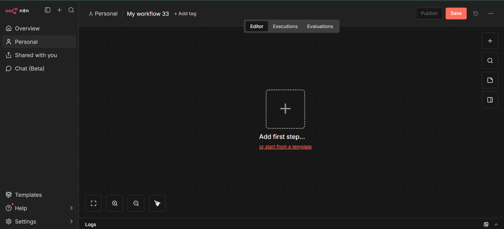

A **workflow** is the whole canvas. Everything you build on it, saved as one file. Right now it is empty, so n8n is asking you to add the very first box, which always has to be a **trigger**.

Notice the tabs at the top. **Editor** is where you build. **Executions** is where every past run gets logged. **Evaluations** is for testing. On the right side there are small icons for adding nodes, searching, and other panel options. Bottom left has zoom controls. We will come back to these as we go.

---

## Step 2 Triggers

Clicking that `+` button opens this panel:

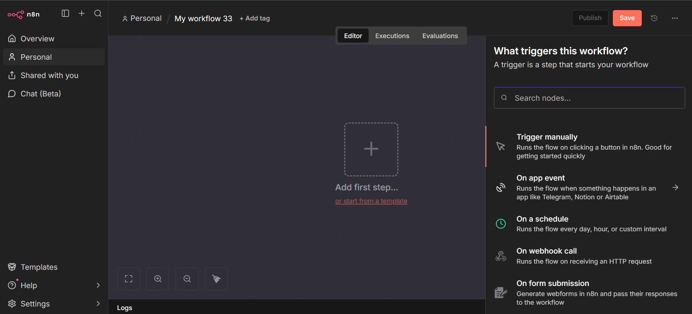

A **trigger** is the node that starts the workflow. Every workflow needs at least one. n8n straight up tells you this. "A trigger is a step that starts your workflow."

There are a lot of trigger types, but here are the ones that actually matter for a beginner, added onto one canvas so you can see them side by side:

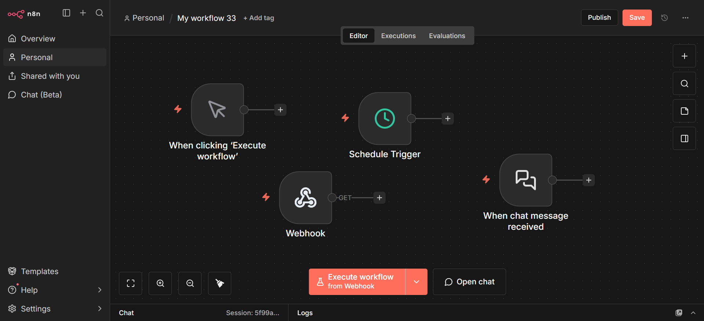

| Trigger | What it does | Same idea in Python |
|---------|-------------|----------------------|
| Trigger manually | You click a button to run the workflow | Just running your script by hand |
| Schedule Trigger | Runs on a timer every hour, every day | A cron job |
| Webhook | Runs when an outside app sends it a request | A Flask or FastAPI route |
| When chat message received | Opens a chat window, runs on every new message | Your `while True` chatbot loop |

Notice the small red lightning bolt icon on each of these. That is how n8n marks a node as a trigger, so you can spot one at a glance in any workflow.

Also notice the bottom bar changes depending on what triggers exist. Here it shows both "Execute workflow from Webhook" and "Open chat", because both a Webhook and a Chat Trigger are sitting on this canvas.

---

## Step 3 Regular Nodes

Not every node is a trigger. Most nodes just do one job with whatever data reaches them. Two of the most common ones:

### HTTP Request

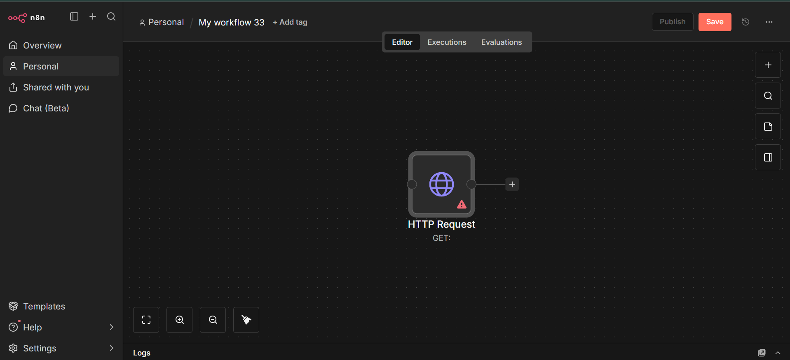

This node calls an outside API. Exactly like `requests.get()` in Python. The globe icon and "GET:" label tell you what it is set up to do. That red warning triangle means it is not configured yet. No URL has been entered.

Opening it up shows the config screen:

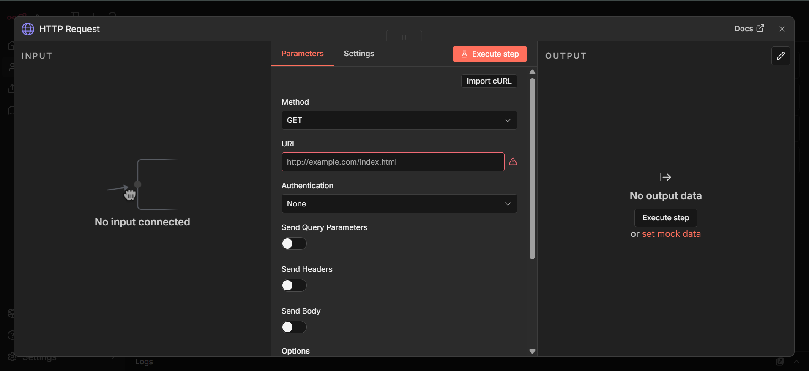

Every node in n8n uses this same three column layout, so once you understand it here, you understand it everywhere.

**INPUT** on the left is the data coming in from the previous node. It says "No input connected" since nothing feeds into it yet.

**Parameters** in the middle are the actual settings. For HTTP Request that is Method, URL, Authentication, and toggles for sending Query Parameters, Headers, or a Body.

**OUTPUT** on the right is what the node returns after it runs. You hit **Execute step** to actually run just this one node and see real output, or use **set mock data** to fake a response so you can keep building without making a real call yet.

### Code Node

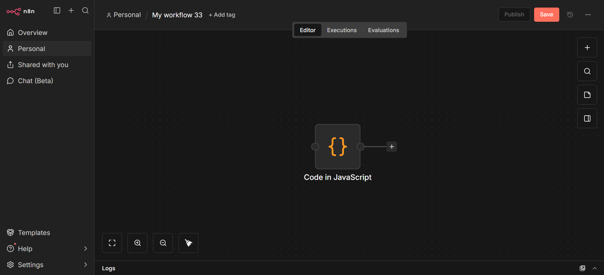

This is the node for when you need actual logic. Loops, conditions, custom calculations. Anything the built in nodes cannot do out of the box. Orange `{}` icon.

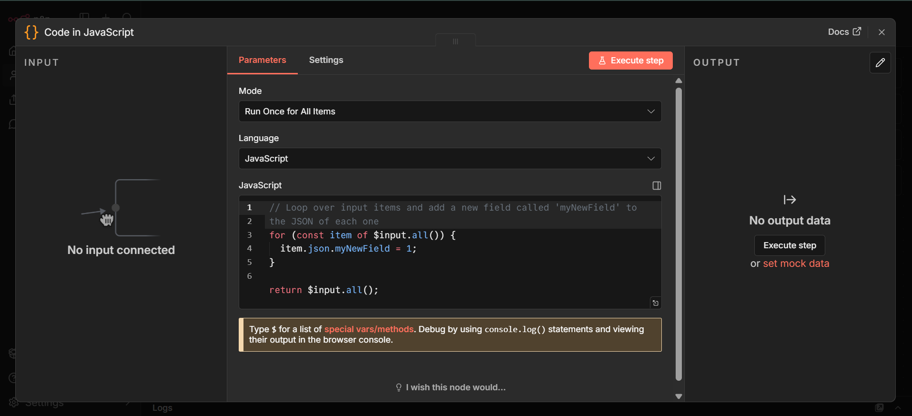

Same three column layout again. The important bits:

**Mode** is either "Run Once for All Items" or "Run Once for Each Item." This decides whether your code runs a single time on the whole batch of data, or loops automatically once per item.

**Language** is JavaScript or Python.

The code editor itself comes pre filled with a starter example that loops over `$input.all()` and returns the result. `$input.all()` here does the same job as looping over a list of dictionaries in Python. It is just how n8n hands you the incoming data inside a Code node.

---

## Step 4 The AI Agent

Now the important part. This is the node your whole chatbot and agent gets built around.

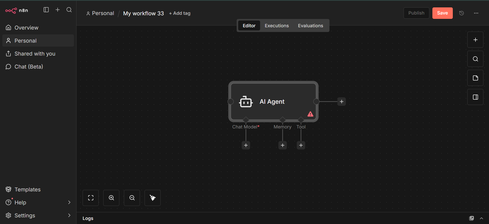

Look at the shape of this. The Agent box sits on top, and three things hang off the bottom of it through diamond shaped connectors. **Chat Model**, **Memory**, and **Tool**. That is not a coincidence. That is n8n visually showing you the exact same four pieces from the Agent guide:

| Piece hanging off the Agent | What it is | Same idea in Python |
|---|---|---|
| Chat Model | The actual LLM doing the thinking | `Groq(...)` client |
| Memory | Remembers the conversation | `chat_history` list |
| Tool | Functions the agent can call | `tool_map` |
| Inside the Agent itself | The system prompt and instructions | Your system message string |

Chat Model has a little red `*` next to it because it is required. An agent cannot run without a model. Memory and Tool are both optional. Notice the red warning triangle on the Agent box itself right now. That is because nothing is plugged into Chat Model yet.

Opening the Agent node shows its settings:

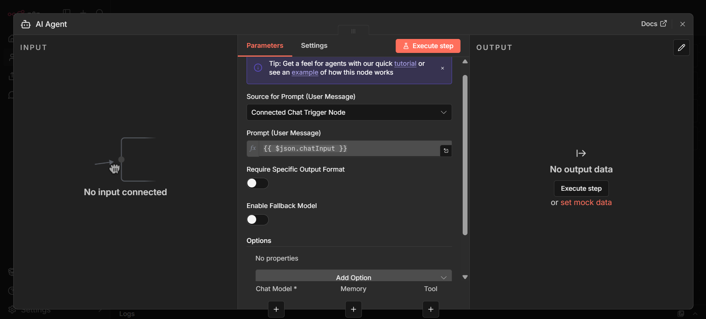

**Source for Prompt** is set to "Connected Chat Trigger Node", meaning it automatically grabs whatever the user typed into the chat.

**Prompt (User Message)** shows `{{ $json.chatInput }}`. This is an **expression**. n8n's way of pulling data from an earlier node. This one means "grab the chatInput field from whatever triggered this workflow". Same job as `user_input = input("You: ")` in Python.

**Require Specific Output Format** forces the agent to reply in a structured format instead of free text.

**Enable Fallback Model** lets you set a backup model in case the main one fails.

Scroll down and you will see the same Chat Model, Memory, and Tool slots repeated here too, with `+` buttons to attach a node to each one directly from this panel.

---

## Step 5 Chat Models

Clicking the `+` under Chat Model opens this:

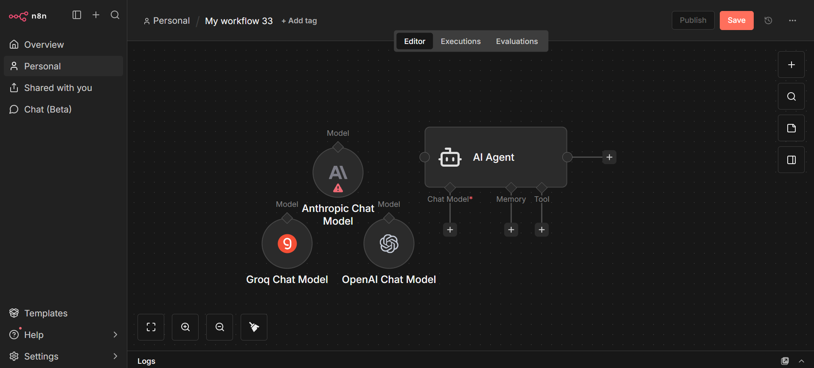

n8n does not lock you into one AI company. Anthropic, Groq, OpenAI. Pick whichever one you have an API key for. This is the exact same idea as swapping `ChatOpenAI` for `ChatGroq` in LangChain Python code, except here it is a dropdown instead of an import line.

Picking one (Groq in this case) asks you for credentials:

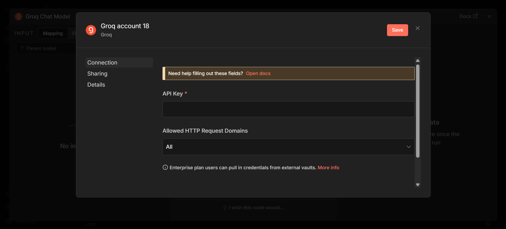

This is important. n8n does not give you an API key. You have to go to that provider's own website, create an account, generate a key yourself, and paste it in here. Once saved, n8n stores it securely and every node afterward just references it by name. You never have to paste the key again.

---

## Step 6 Memory

Clicking the `+` under Memory opens this:

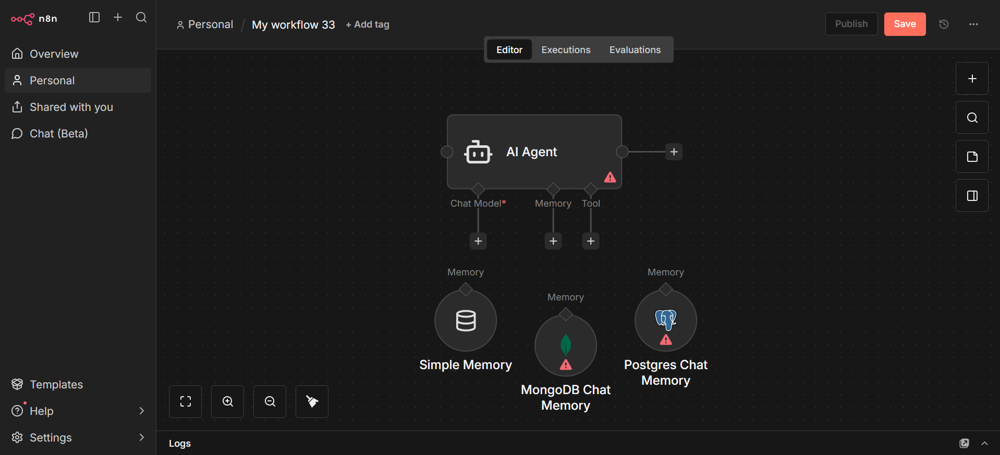

**Simple Memory** remembers the conversation in memory with no setup needed. This is basically your `chat_history` list.

**MongoDB Chat Memory** and **Postgres Chat Memory** remember the conversation in a real database, so it survives even if the workflow restarts.

Both database options show a red warning triangle because they need credentials configured first. Same idea as the Chat Model step above.

Opening Postgres Chat Memory shows what it actually needs:

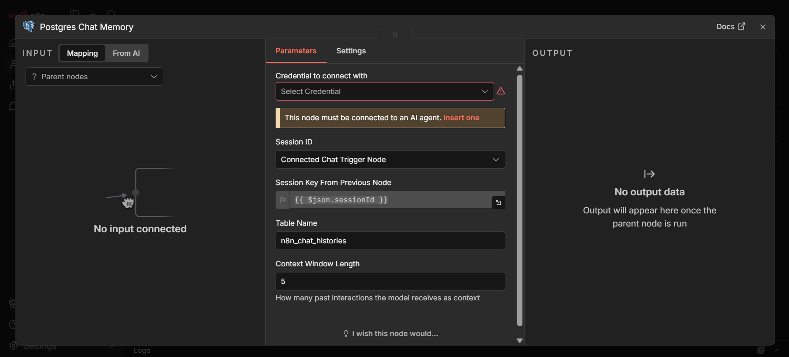

A helpful note right at the top says "This node must be connected to an AI agent". Memory nodes do not do anything by themselves. They only work once plugged into an Agent's Memory slot.

**Session ID** is set to "Connected Chat Trigger Node" by default, so each conversation gets its own separate memory automatically.

**Table Name** is `n8n_chat_histories`, the actual database table where the conversation gets saved.

**Context Window Length** is how many past messages get sent back to the model as context. Set to `5` here. Same trade off as picking a window size in Python. Too small and the AI forgets things. Too large and you are sending unnecessary tokens every call.

---

## Step 7 Tools

Clicking the `+` under Tool opens this:

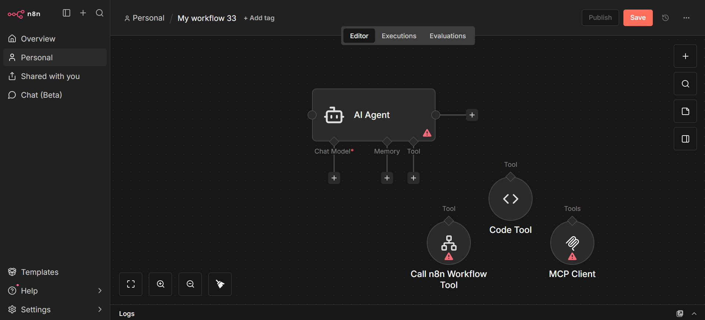

**Code Tool** lets you write your own JavaScript function as a tool. Same editor as the Code node from Step 3. This is the most direct match to `tool_map` from the Python guide. A function the agent can decide to call.

**Call n8n Workflow Tool** lets the agent call an entire separate n8n workflow as if it were one tool. Useful once things get more complex.

**MCP Client** connects to an external MCP server and lets the agent use its tools. If you have touched MCP already, this is the same concept, just wired in visually.

Opening MCP Client shows its settings:

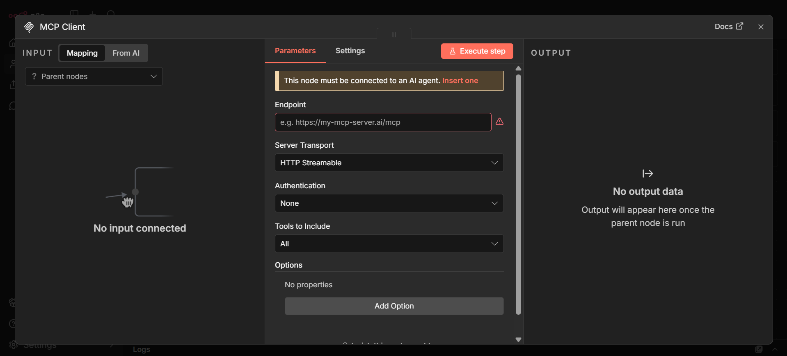

Same "must be connected to an AI agent" note as memory. Key fields are **Endpoint** which is the MCP server's URL, **Server Transport** set to HTTP Streamable here, **Authentication**, and **Tools to Include** which can be all tools from that server or just specific ones.

A tool's **description** field is what the agent actually reads to decide when to use that tool. No description means the agent does not know the tool exists or what it is for. So writing a clear specific description matters just as much here as writing a good docstring for a Python function.

---

## Word List

| Word | Simple meaning |
|------|--------------|
| Workflow | the whole canvas, saved as one file |
| Node | a single box that does one job |
| Trigger | the node that starts a workflow |
| Connection | the wire linking two nodes |
| Expression | n8n's `{{ }}` syntax for pulling data from another node |
| Execution | one full run of a workflow, logged for debugging |
| Credential | a stored API key or login, reused across nodes |
| AI Agent node | the decision maker. decides to answer directly or call a tool |
| Chat Model | the actual LLM plugged into the Agent |
| Memory node | stores the conversation history |
| Tool node | a function the agent can choose to call |
| Session ID | what keeps different users conversations separate in memory |
| MCP Client | a node that connects the agent to an external MCP server |

---

## Official n8n Docs

This guide only covers what you need to get comfortable with the basics. For the full official reference:

🔗 [https://docs.n8n.io](https://docs.n8n.io)

---

## Whats Next

You have now seen every piece an AI Agent is built from. Trigger, model, memory, and tools. The exact same shape as the chatbot you already built in Python.

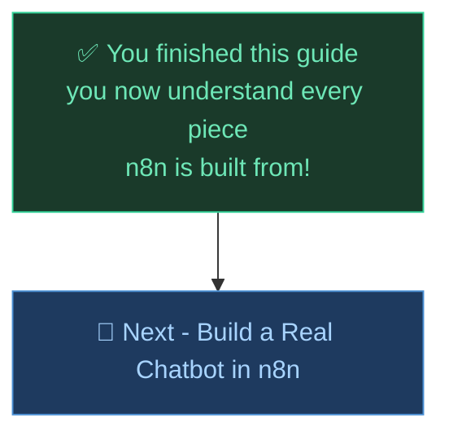

---

*Made by Abdul Samad*
